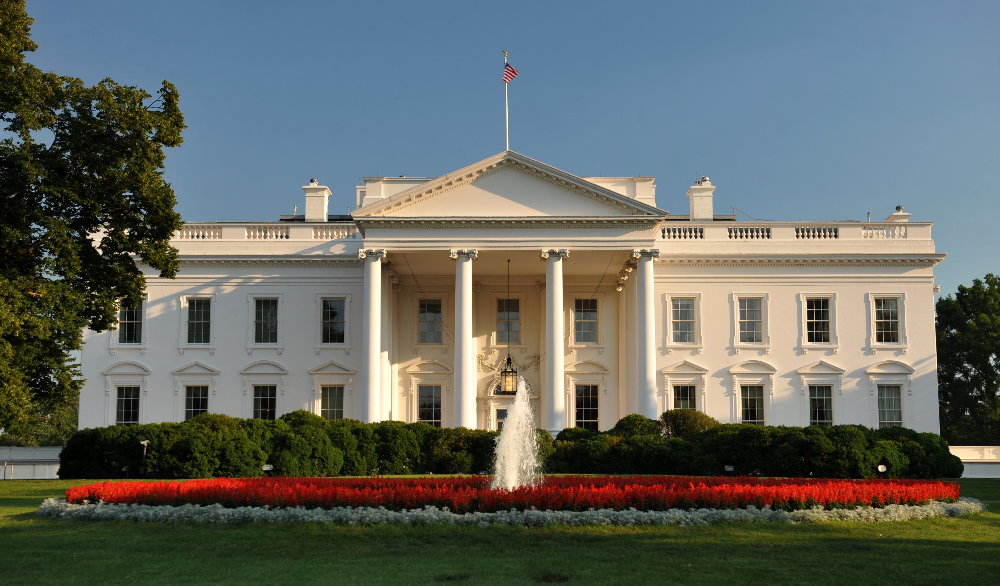
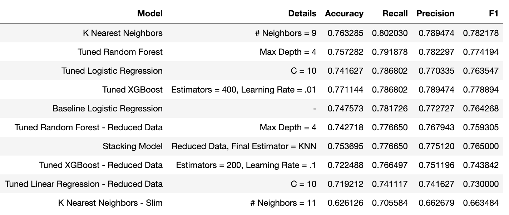
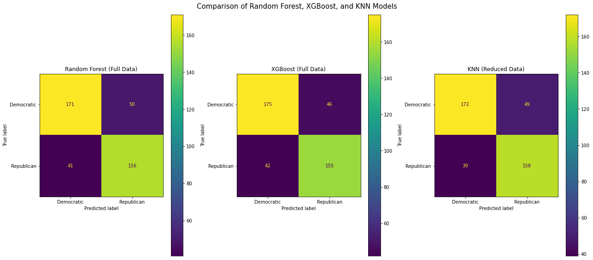
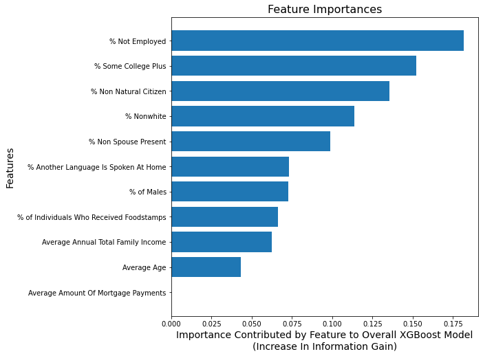
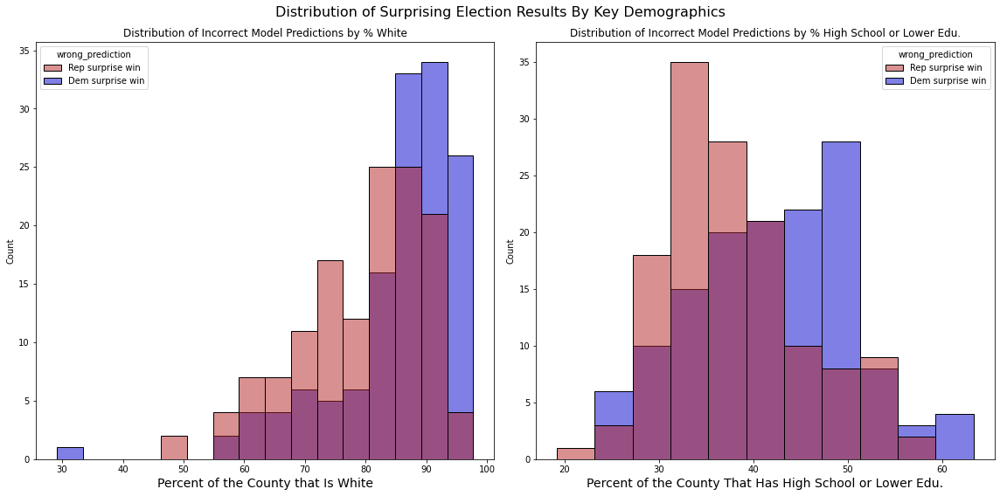

# County-Level Presidential Election Modeling

## Overview

**Note: This project is for academic purposes only, and is not intended as an endorsement of any political party.**

I was tasked with creating a model to predict which party will win more votes in a county in a United States presidential election based on various demographic features of that county. This model can be used by political parties to identify emerging counties of interest in the lead-up to an election to help guide their decisions on where to allocate advertising, field organizing, and other resources.

I used county-level demographic and presidential election data from the US Census Bureau and MIT Election Data + Science Lab that had been consolidated into a single dataset on Kaggle. The data included information from four presidential elections (2008, 2012, 2016, and 2020), each of which took place in a different national political context and with varying levels of national election turnout. In this dataset, a county is assigned a "positive result" (1) if the Republican got the most votes in that county, and a "negative result" (0) if the Democrat got the most votes in that county.

When building my models, I prioritized maximizing recall (to avoid "false negatives" - counties that we predicted would vote Democratic but actually voted Republican) to minimize the chance that we would lose a county that we expected to win - a result that may cost us a national election. I also prioritized accuracy, because each incorrect prediction in either direction may cost us valuable campaign dollars or electoral votes.

After numerous attempts, I selected a final model that used a simplified version of my dataset and a K Nearest Neighbors classifier with a nine-neighbor hyperparameter because it had the highest recall score of any of the models I created, with comparable accuracy, precision, and f1 scores. This model had a recall of nearly 81%.

Based on the analysis below, I can make the following recommendations:

1. Keep a particularly careful eye on counties where a large proportion is not in the labor force. This was the key predictor of Republican victories in one model, and an important feature in multiple models.

2. The party should use a distance-based model, such as a K Nearest Neighbors model, to generate its predictions because this model generated highest recall score, meaning it was the least likely to incorrectly predict a Democratic victory (false negative, in the context of this model). These incorrect predictions have the greatest downside to the party because they may result in losing an election unexpectedly.

3. Based on which predictions were incorrect, I recommend that the Democratic Party work to shore up its base to avoid further surprising electoral losses in counties with lower White populations, and adopt positions that will help it to win back voters with a high school or lower education to stem the tide of surprising losses in these counties that it has faced in the last four elections.

## Business Problem

Despite winning three of the last four presidential elections, the Democratic Party in the United States faces a perilous political future. A [small number of states](https://www.cnn.com/2022/11/22/politics/2022-preview-2024-presidential-election/index.html) hold the key to swinging any given presidential contest. The near-inverse results of the 2016 and 2020 elections in terms of total electoral college votes despite [small swings in the popular vote margins of these states](https://www.washingtonpost.com/elections/election-results/president-2020/) demonstrates the importance of allocating campaign resources efficiently.

The 2020 election proved that the Democratic Party can return states it had lost in 2016 to its column (Michigan, Wisconsin, Pennsylvania) while simultaneously picking up new states for the first time since the 1990s (Arizona, Georgia). In order to protect these gains, and expand the electoral map to open new opportunities, the party must have an understanding of what factors make a state likely to tip to one party or the other in the coming years.

I chose to conduct my analysis at the county level because while presidential elections are decided at the state level, political parties build operations (such as "get out the vote" efforts and digital advertising campaigns) that target voters at the most granular geographic level possible and need information to guide these decisions. Additionally, these predictions are only meant to be one piece of the puzzle - they can be put in the broader political context of the state and nation as part of the process of developing a comprehensive campaign strategy. 

By building a predictive model to project the winner of presidential elections at the county level, the party can better understand what factors make a given area likely to vote one way or the other in coming elections. It can use this knowledge to guide its investments in emerging fertile areas or to shore up states that are at risk of slipping away.

## Data Understanding

I used [data from the US Census Bureau and MIT Election Data + Science Lab](https://www.kaggle.com/datasets/minhbtnguyen/us-census-for-election-predictions-20002020) that had been consolidated into a single dataset on Kaggle. The data included information from four presidential elections (2008, 2012, 2016, and 2020), each of which took place in a different national political context and with varying levels of national election turnout. The dataset also includes a variety of descriptive demographic statistics such as average income, average age, gender, race, education attainment, and other factors [associated with voting behavior.](https://www.icpsr.umich.edu/web/pages/instructors/setups/voting.html) After cleaning, the data had 1670 rows and 27 columns. I also created a simplified dataset with 11 columns to conduct further analysis, and it was using this dataset that I created my final model.

The original dataset's columns were percentages, where the sum of the percentages of like columns was always 100. For example, the "sex_2_freq" (% female) and "sex_1_freq" (% male) summed to 100 for every row because every county's population was only recorded as being one of those two genders. The same was true for the columns in each category - food stamp recipients, marriage status, race, citizenship status, language spoken at home, educational attainment, and employment status. To avoid perfect multicollinearity within categories when training the model, I dropped one column from each category to serve as the "reference" or "default" column. I also dropped the columns with vote counts, because they would be an ovious form of data leakage when predicting the winner of an election.

When creating the simplified dataset later, I consolidated each of the "non-default" columns into a single value to further reduce multicollinearity and normalize the distribution of my features. While this simplified dataset did not improve the performance of any of my existing models, it did allow me to create a K Nearest Neighbors model that I eventually identified as my strongest option.

The distribution of counties won by Democrats vs. Republicans was roughly equal - 51% Democratic victories and 49% Republican victories. This helped avoid any pitfalls resulting from a class imbalance when measuring the performance metrics of my models.

## Modeling and Evaluation
I created 10 models to predict county-level election results. I tried several different classes of models, utilizing a grid search to test multiple hyperparameter combinations for each model: logistic regression, random forest, XGBoost, KNN, and a stacking model that utilized all of them.

Their performance across my selected metrics - recall and accuracy, along with precision and f1score - is listed below, sorted by the highest recall.

Since my goal was to minimize false negatives (predicted Democratic victory, actual Republican victory), I selected the KNN model because it had the highest recall.

I also pulled the coefficients from the logistic regression model, and the feature importances from each of the random forest and XGBoost models, to see which came up near the top most often. I found one feature in particular that was highly predictive - **the proportion of the population that is not currently employed.**

In the logistic regression, the coefficient for the % Not Employed variable suggests that each additional standard deviation increase in the percentage of the population that isn't currently employed (about a 6.5 percentage point increase) is associated with a 28 percentage point increase in the likelihood the Republican wins, holding all other variables equal. For Democrats, that means keeping a close eye on counties currently experiencing an influx of retirees or an economic downturn.

After selecting the KNN model I ran it on the entire dataset to generate predictions for each county. I then created a subset of the data to examine predictions that are incorrect to better understand where surprising election results may occur, and found two particularly interesting results:

Democrats earn surprising wins in areas with high white populations and areas with high populations of people with a high school or lower education; Republicans earn surprising wins in the opposite areas. To remain competitive at the national level going forward, Democrats will have to figure out how to maintain their strength in the former areas while shoring up their base in the latter.

## Recommendations and Next Steps
Based on the analysis above, I can make the following recommendations:
1. Keep a particularly careful eye on counties where a large proportion is not in the labor force. This was the key predictor of Republican victories in one model, and an important feature in multiple models.
2. The party should use a distance-based model, such as a K Nearest Neighbors model, to generate its predictions because this model generated highest recall score, meaning it was the least likely to incorrectly predict a Democratic victory (false negative, in the context of this model). These incorrect predictions have the greatest downside to the party because they may result in losing an election unexpectedly.
3. Based on which predictions were incorrect, I recommend that the Democratic Party work to shore up its base to avoid further surprising electoral losses in counties with higher populations of color and higher educated communities.

With more time and data, I would like to make the following refinements to the model:
- Include more counties in the dataset from the last four elections to increase the amount of training data available.
- Include features related to the political composition of each county, such as voter registration statistics.
- Evaluate how county vote shares and demographics have changed over time to see if any relationships exist.
- Examine how the model's incorrect predictions may have differed by year to see if there are any trends in surprising results.

## Links to Materials
[Presentation](County_Level_Presidential_Predictions.pdf)  
[Jupyter Notebook](County_Pres_Election_Modeling.ipynb)
